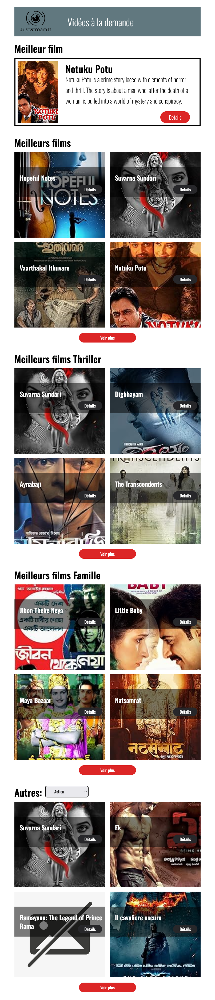

<h1>JustStreamIt</h1>

## Description

JustStreamIt est une interface web qui affiche les Meilleures affiches des films.
Elle récupère les données des films depuis le service API OCMovies.

Elle contient plusieurs sections :

- L'affiche du meilleur film toutes catégories confondues
- Les 6 meilleurs films toutes catégories confondues
- Les 6 meilleurs films de la catégorie Thriller
- Les 6 meilleurs films de la catégorie Famille
- Les 6 meilleurs films de la catégorie au choix

## Apperçu Desktop, tablette et mobile

 

## Installation

1. Ouvrir un terminal
2. Se placer dans le dossier de votre choix
3. Cloner le projet avec la commande : 
   
   `git clone https://github.com/wilodorico/Projet-6-JustStreamIt.git`

4. Installez les dépendances avec la commande : 

   `npm install`

## Cloner et démarrer le service API
Suivre les intructions du service API OCMovies ici > [Service API OCMovies](https://github.com/OpenClassrooms-Student-Center/OCMovies-API-EN-FR)

## Lancer le projet
1. Démarrer le serveur API OCMovies
2. Ouvrir la page index.html dans votre navigateur
   1. Soit en glissant le fichier dans votre navigateur
   2. Soit en faisant un clic droit sur le fichier et en sélectionnant "Open with live server"

## Réalisé par

Projet réalisé par [Wilfried Odorico](https://github.com/wilodorico) Développeur d'applications.
